Once upon a time, in the heart of a lush Belgian spring, my family and I embarked on a road trip to Brussels, the vibrant capital known for its stunning architecture and rich history. The city was alive with the fresh green of new leaves, and the air was filled with the promise of adventure.

We arrived in Brussels in beautiful spring weather, the sun radiating a gentle warmth, not too hot and not too cold, perfect for walking. Our apartment was a 15-minute walk from the central part of the city, which allowed us to walk without stopping every day and discover new and new beautiful places

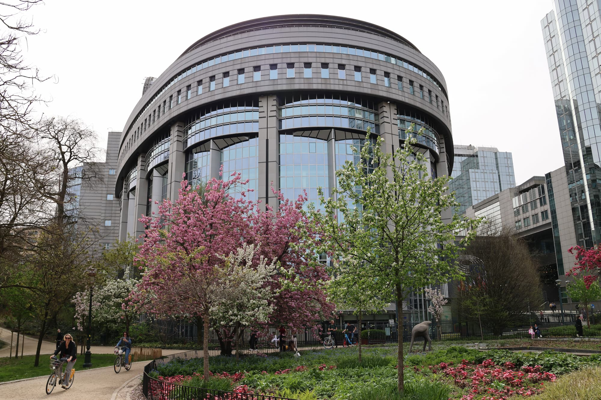

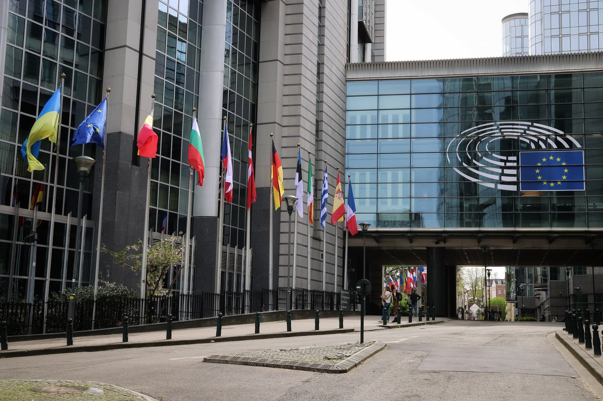

The city's architecture was a feast for the eyes. We wandered through cobbled streets lined with grand buildings that told stories of centuries past. The Gothic spires of the Town Hall rose majestically into the sky, while the baroque facades of guild houses sparkled with gold.

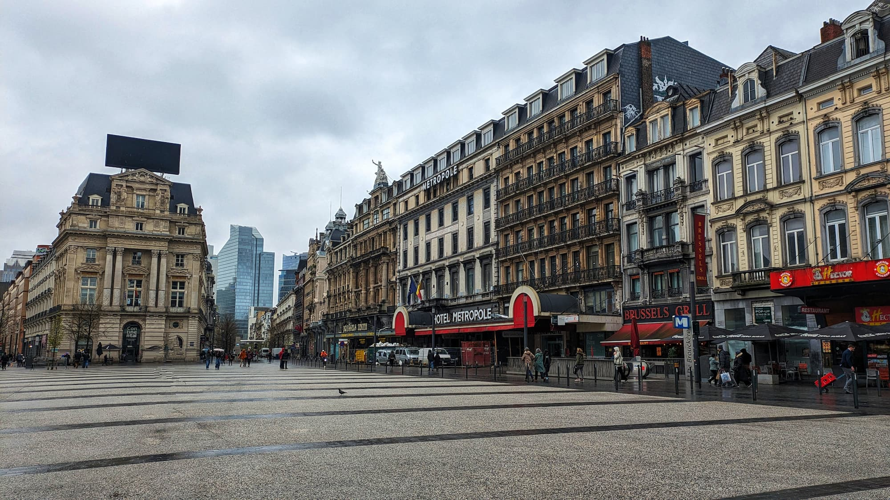

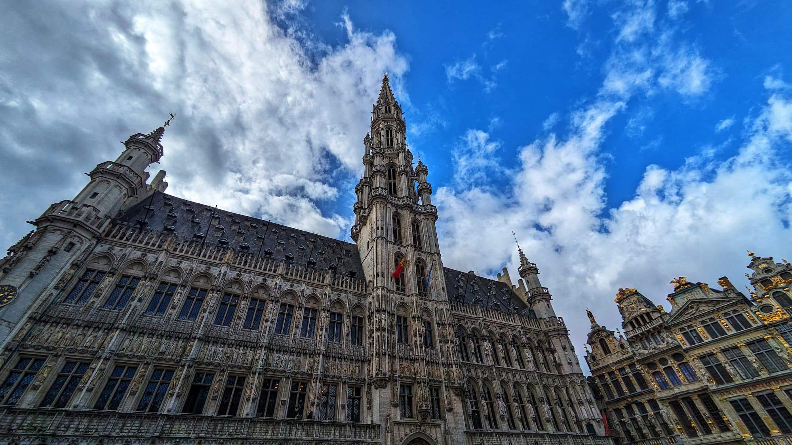

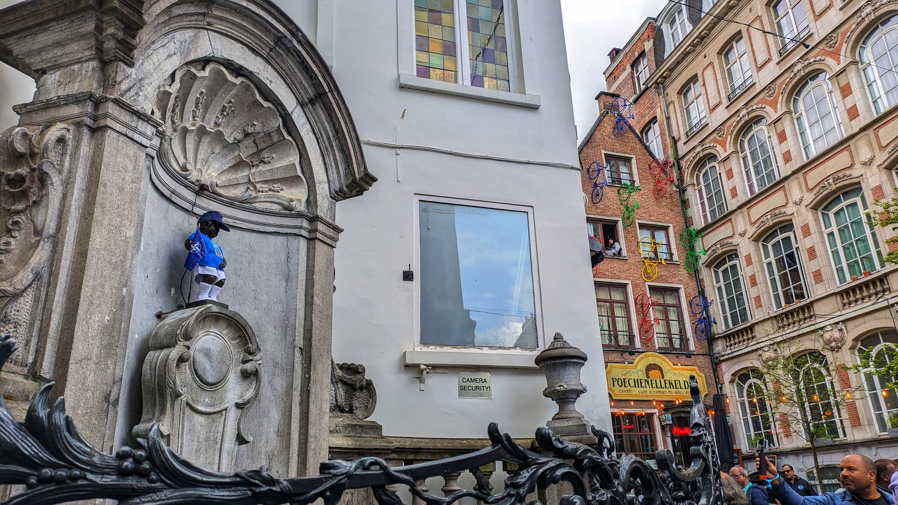

However, as we explored further, we noticed an incongruous sight amidst the beauty—pockets of trash littered some streets, marring the city's historic charm. It was a stark reminder that even the most beautiful places aren't perfect.

On the third day of our stay, we decided to take a break from the bustling city and drove to Brugge. The picturesque town was like a page from a fairy tale, with its medieval buildings and tranquil canals. We spent the day meandering along cobbled lanes, crossing tiny bridges, and indulging in the famous Belgian chocolate that seemed even more delectable there.

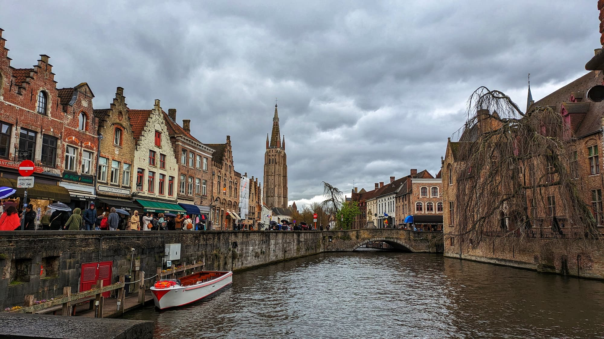

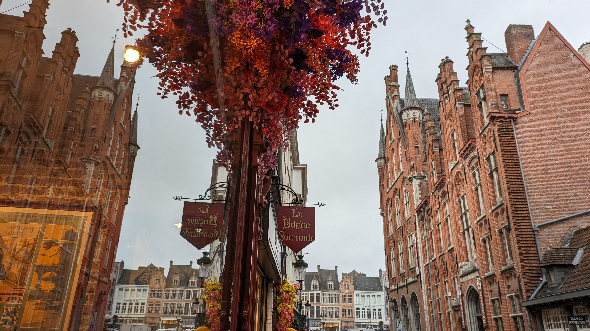

I got the impression that we will definitely need to visit Bruges again, with at least two overnight stays to better immerse ourselves in the atmosphere of this beautiful city. I think that someday we will definitely go back there.

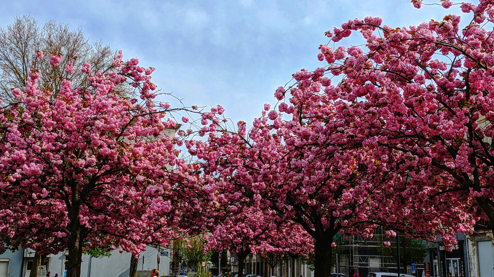

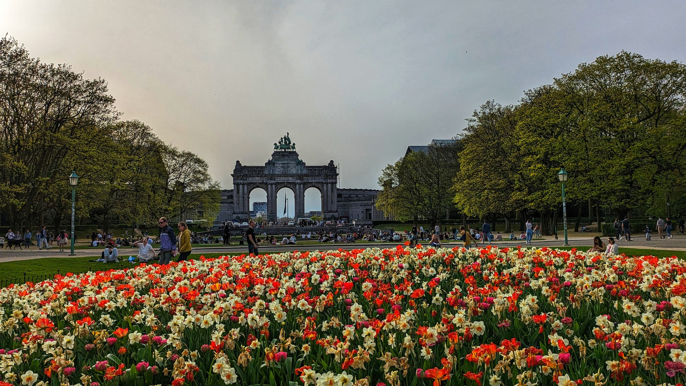

Having returned to Brussels, we continued to walk around the city and explore it. There was an interesting incident when we tried to enter the metro, bought three tickets, but kind people, after my wife went through, grabbed the gates and held them open, allowing everyone to enter for free. It was quite unusual and a bit unsettling. Especially our child was very surprised by such behavior, and overall, we then had a lot of discussions on this topic.

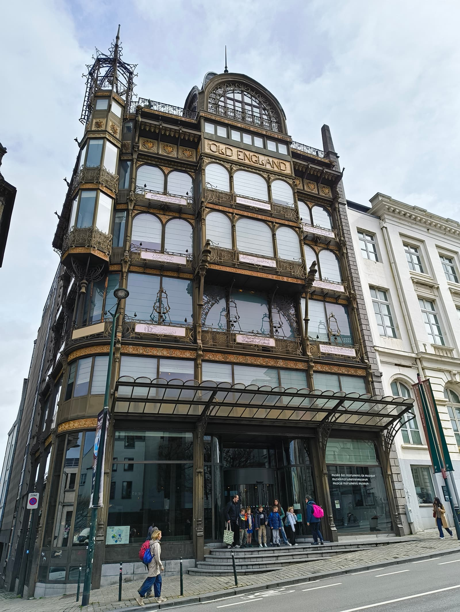

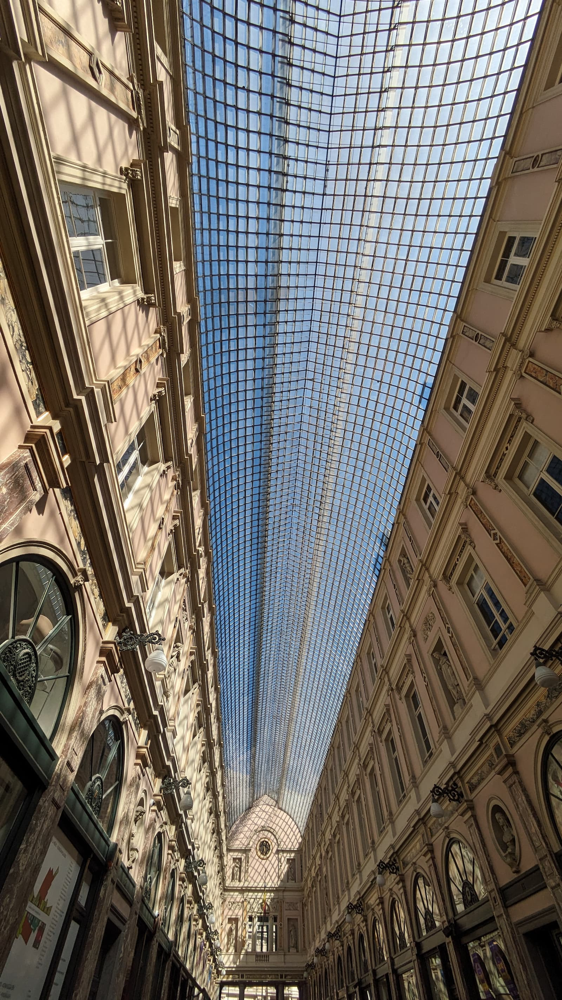

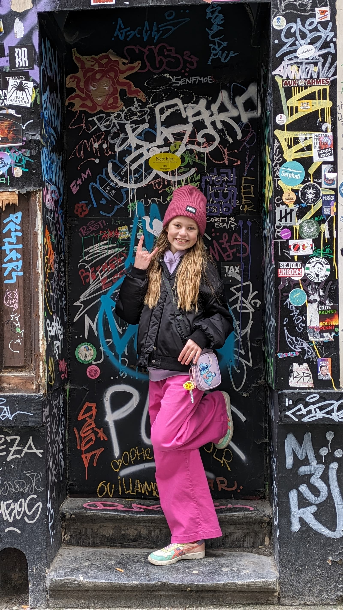

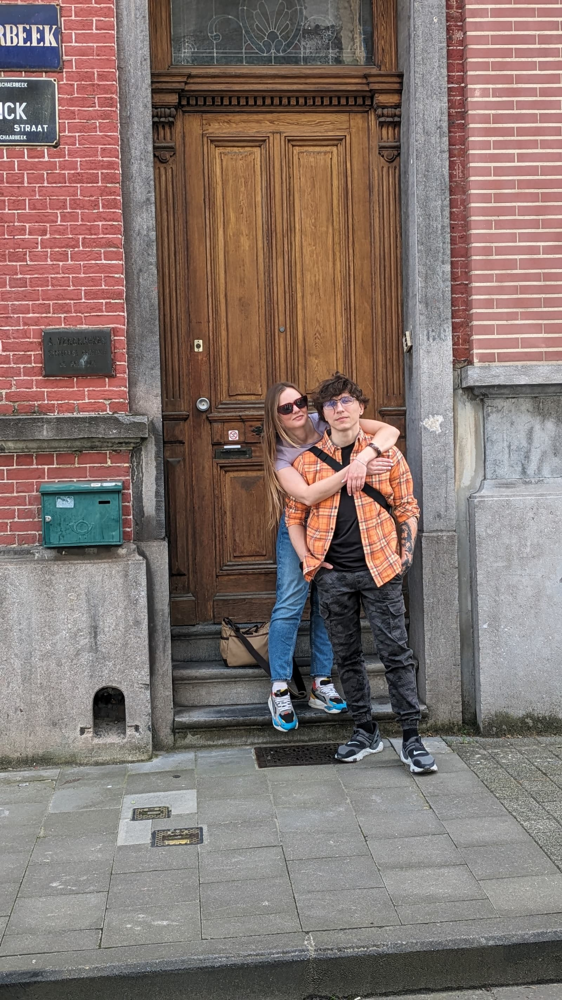

Towards the end of our stay there, I had an appointment with a tattoo artist to finish a tattoo that I had started a year and a half ago. This moment was actually one of the initiators of our trip.

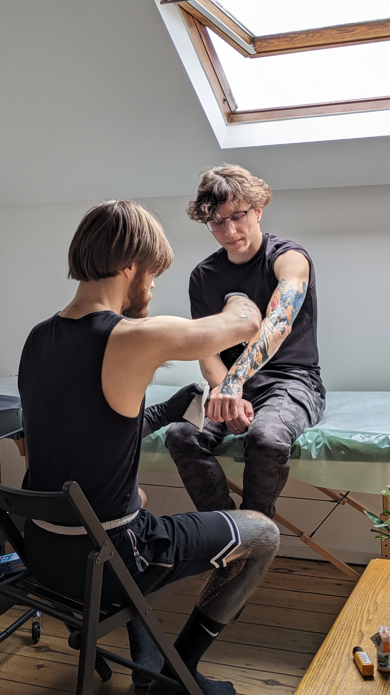

After getting the tattoo, I rested for a day before the long journey home, we wandered around the city again, drank exquisite coffee in chic coffee shops, visited a huge flea market, unfortunately, it was mostly clothes there, we would have liked to look for furniture in such places. And we were ready to head home. At that moment, it seems to me, we clearly realized that the place and the city are simply delightful and have really won our hearts, and we are definitely here not for the last time, despite the fact that in some places there was a huge amount of trash, which was initially shocking, and the water, which in terms of quality, was very much worse than what we have at home flowing from the tap.

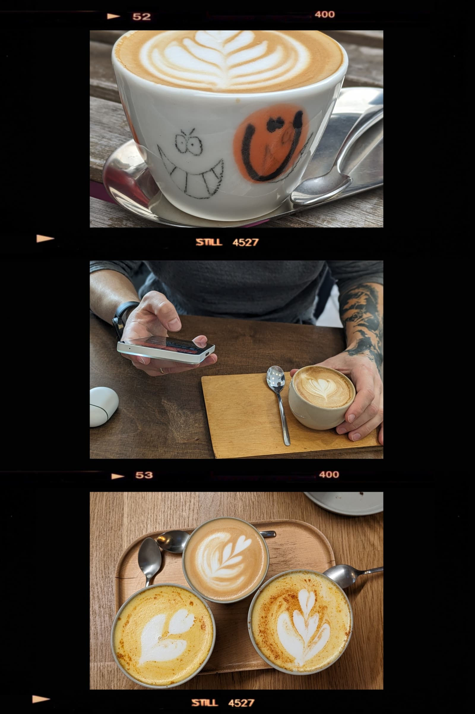

In general, Brussels is one love <3

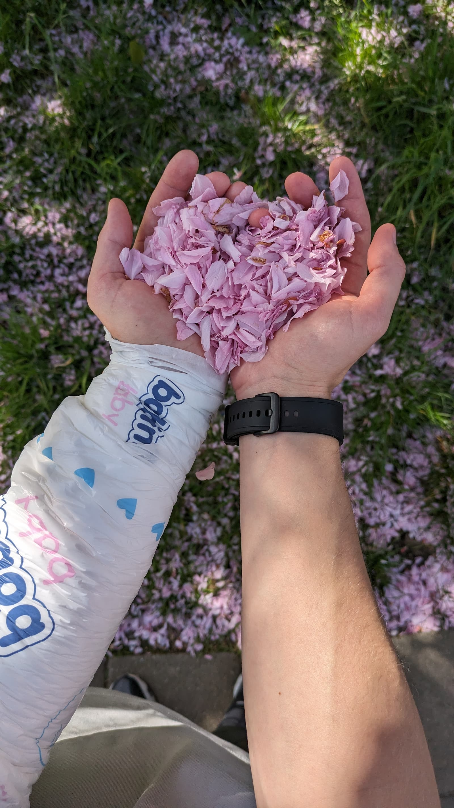

---

**P.S.**

I will create another post about the tattoo and tattoo artist, I hope :)

---

Photos by me and my wife. By the way - she will be happy if you follow her on [Instagram](https://www.instagram.com/dream_quarter/).
