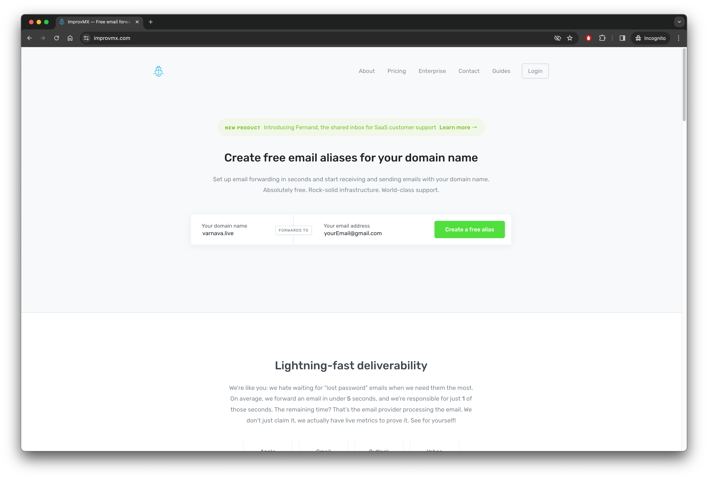
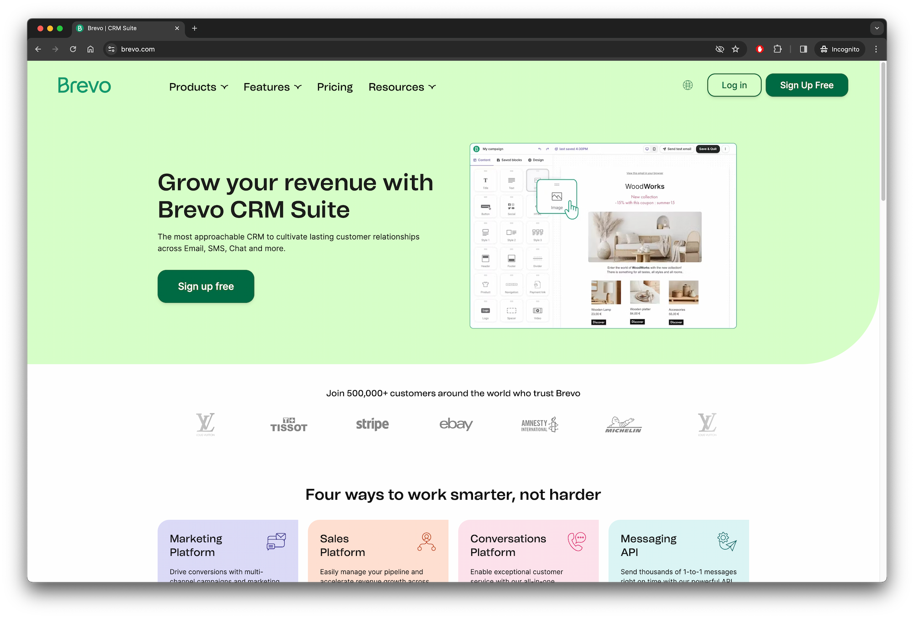
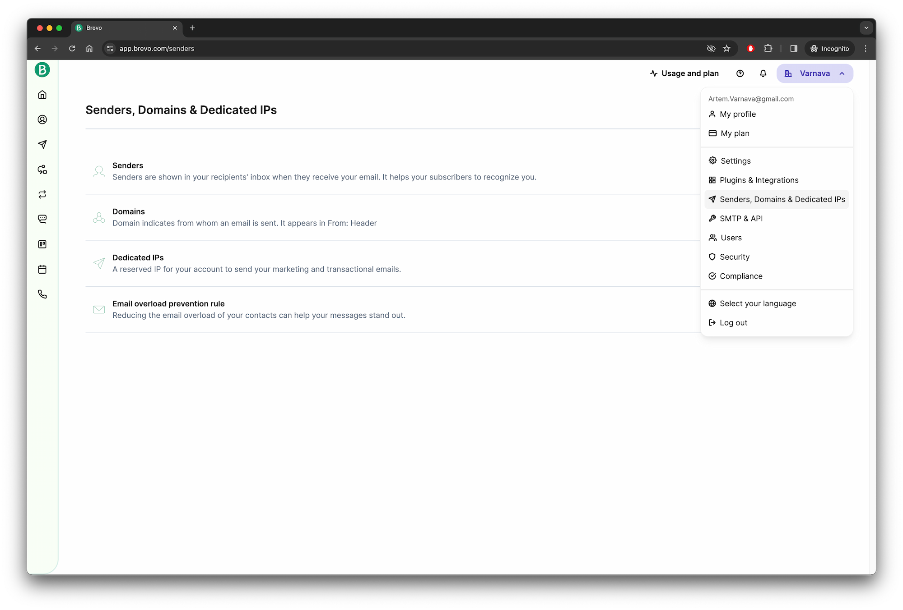
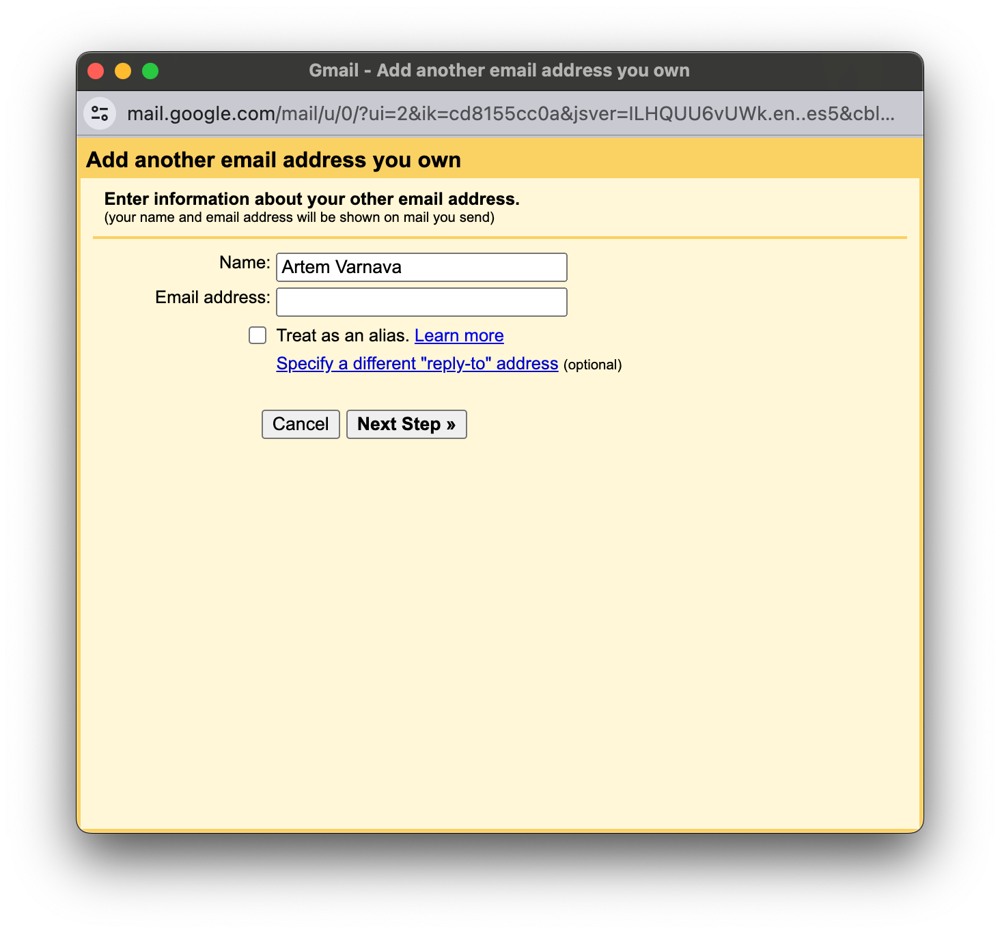

I started thinking about creating an email with my own domain. Previously, this could be done for free with two clicks using various services. But now, many things have changed, and almost everywhere, some kind of subscription is required. Since it's not the most necessary thing, I had to spend some time finding a way to do it conveniently and for free, and I'll share it with you.

## 1. Register a domain

This goes without saying; you should have your own domain and the ability to manage its DNS records. In my case, the chosen domain was **varanva.live**.

## 2. Make sure you have a Gmail account

No need for comments here, just go to your email and move on.

## 3. Set up receiving emails

Go to the [ImprovMX](https://improvmx.com/) website and create an alias for your domain and register immediately. The free account has limitations such as:

- only 1 domain
- up to 25 aliases for the domain
- up to 500 incoming emails per day
- attachments up to 10MB only

In general, it looks quite wonderful for the free version. If you need more, the user recommends opting for paid email services or purchasing a subscription.

The next steps involve email confirmation, adding necessary DNS records, and verifying everything is configured correctly. The user mentions that the service creators made an effort to make these steps clear, and in my opinion, they succeeded, so I won't go into detail about these steps.

After completing these steps, the passage notes that emails sent to your domain will be forwarded to your Gmail account **yourName@gmail.com**.

## 4. Configure sending emails from your domain

For this, I recommend using [Brevo](https://www.brevo.com/). There are many other services, but this one worked well for me. There are no questions about its performance; everything works as it should.

Register and confirm your email. You can use the domain you created in the previous step for registration, but it's not necessary.

Then, in the account menu, choose Senders, Domains & Dedicated IPs, go to Domains, and add your domain. You'll also need to add DNS records and ensure everything is set up correctly.

After adding the domain, go to the **SMTP & API** section in the same menu. You'll find the data needed for the next step. I recommend **generating a new SMTP key** for security instead of using your account password.

There are limitations for a free account here too:

- sending up to 300 emails per day

## 5. Set up sending emails from your domain in your Gmail account

The main part of the work is done; now you just need to add your SMTP server in Gmail settings. Go to settings, navigate to the **Accounts and Import** tab, and in the **Send mail** as section, click **Add another email address**. Fill in the form using the information from the previous step, uncheck **treat as an alias**, and proceed.

You'll be asked to enter a verification code, or you can find the confirmation email in your inbox and follow the link to complete the addition of the new address.

That's it; now you have multiple email addresses to choose from in your Gmail account. You can select any of them as the sender of your email. Also, any of them can be set as the default, which is controlled in the same settings where you added the new address.

## Conclusion

By spending 10 minutes on setup, you get a completely free solution that fully satisfies personal needs for an individual email with your own domain. The limitations of the services may not suit everyone, but in that case, consider paid options, as it seems you use email not quite like a typical user.

I've been using this setup for some time now and can confidently recommend it. If anyone knows of more interesting options, I'd be glad to hear about them in the comments.
