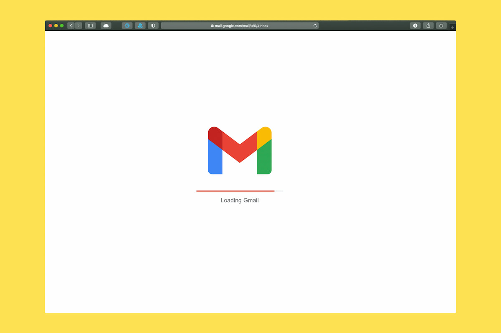

I was really surprised that almost all my friends didn't know about that 2 powerful tricks with the Gmail ID.

## 1. Use + to create unlimited siblings of your gmail address

It is the most wanted feature that allows you to change a bit your existing address and have all advantages from it. You just need to add '+' after your ID and put everything that you want. For example your email is Name.Surname@gmail.com, so you can have Name.Surname+spam@gmail.com. It will help you at least to filter out a lot of spam messages and to register few accounts on one service if you'll need. Don't worry, you will receive all this emails in your existing account, but you will have possibility to filter them like a boss.

## 2. Use . to create multiple addresses of your primary address

This one not so much useful as the first one, but it is a very popular trick to change your ID. You can just change your Gmail ID with putting '.' everywhere and it will be the same address. As for example from previous trick, your Name.Surname@gmail.com will be equal NameSurname@gmail.com. Gmail ignoring dots, so you can use this trick too. Some services doesn't recognise it as different addresses, but you can try. For example you can manipulate with the name to separate personal and business emails.

Gmail has a lot of different cool features, but I was really surprised that a lot of people doesn't know about that 2 things. Hope this post will help you to improve your skill as Gmail user.
