My birthday this year wasn't just about cake and candles. It was about fulfilling a long-held dream of exploring Bavaria. The allure of southern Germany's stunning landscapes and rich history had always captivated me and my wife, and finally, we were stepping on the car, ready to embark on an adventure. Little did I know, this adventure would morph into a quest for unexpected sunshine, revealing a side of Bavaria I never dreamed possible.

Our journey began in stark contrast to the Bavarian beauty that awaited. Leaving rainy Poland was like shedding a heavy coat, trading drizzle for the warm embrace of the sun. Stepping into Bavaria felt like stepping into a fairytale. Lush, rolling hills dotted with quaint villages unfolded before me, a stark contrast to the damp streets I'd left behind. The air hummed with a vibrant energy, and the snow-capped peaks of the Alps gleamed in the distance, beckoning me closer.

This February escape wasn't just about birthday celebrations, it was a personal discovery fueled by the unexpected. The sun-kissed landscapes and vibrant spirit of Bavaria painted memories that will forever be etched in my heart. It was a reminder that sometimes, the most magical moments unfold when we least expect them, transforming a trip into something truly extraordinary.

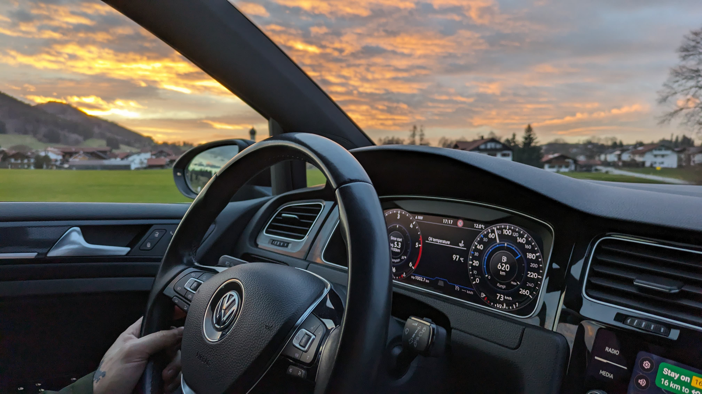

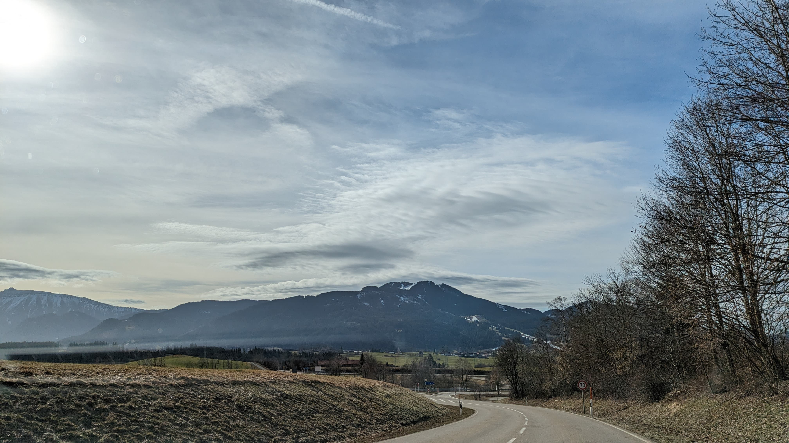

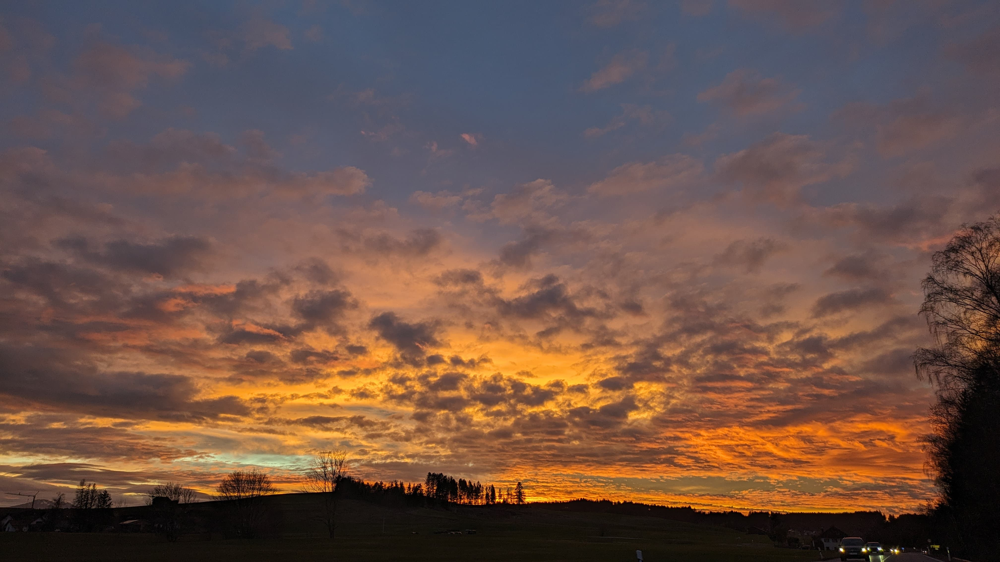

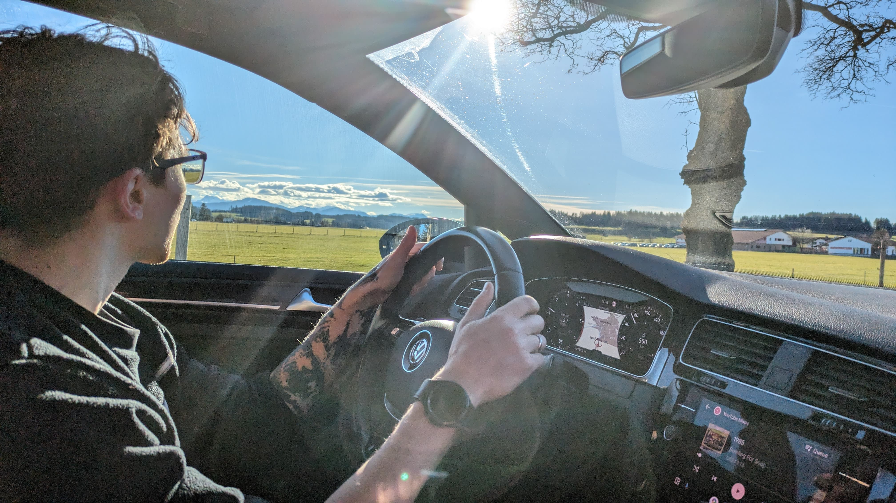

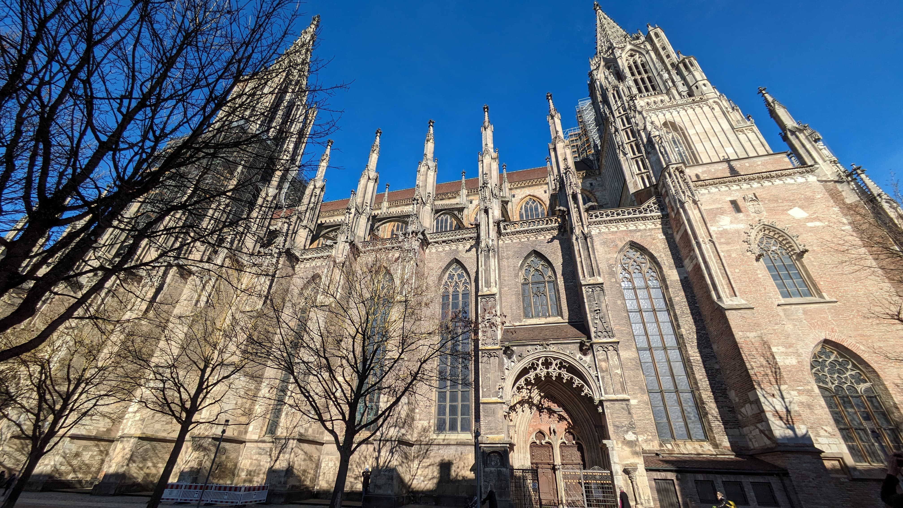

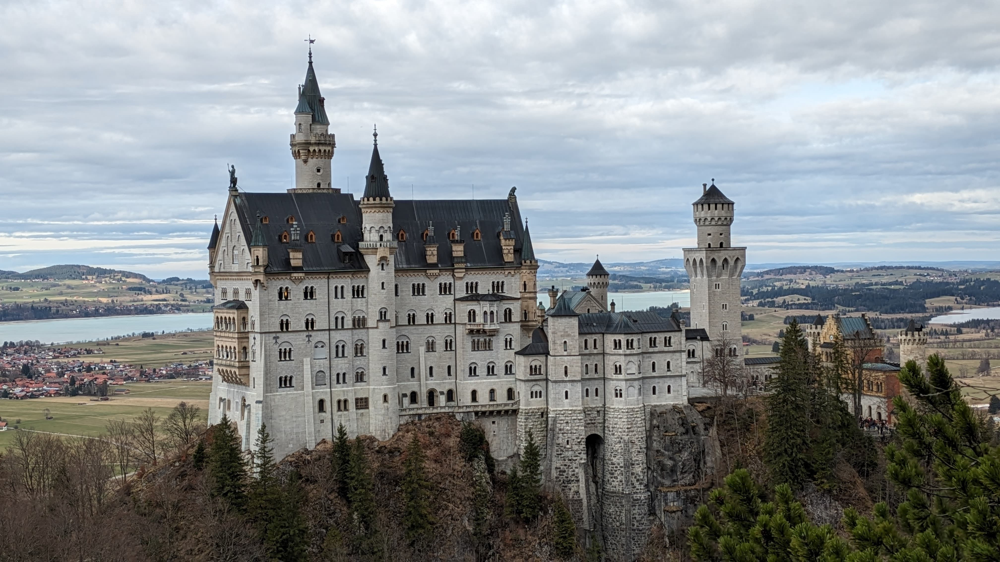

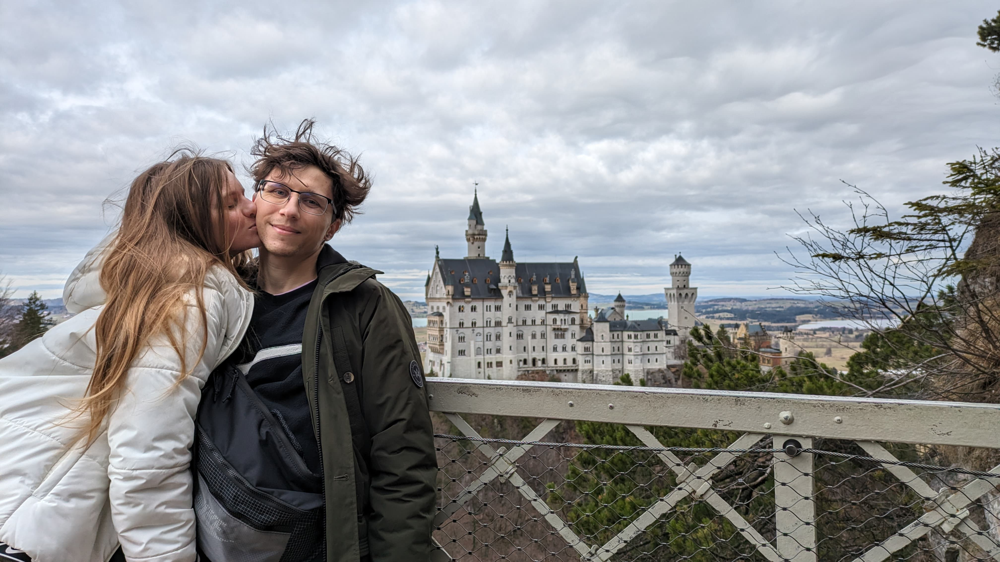

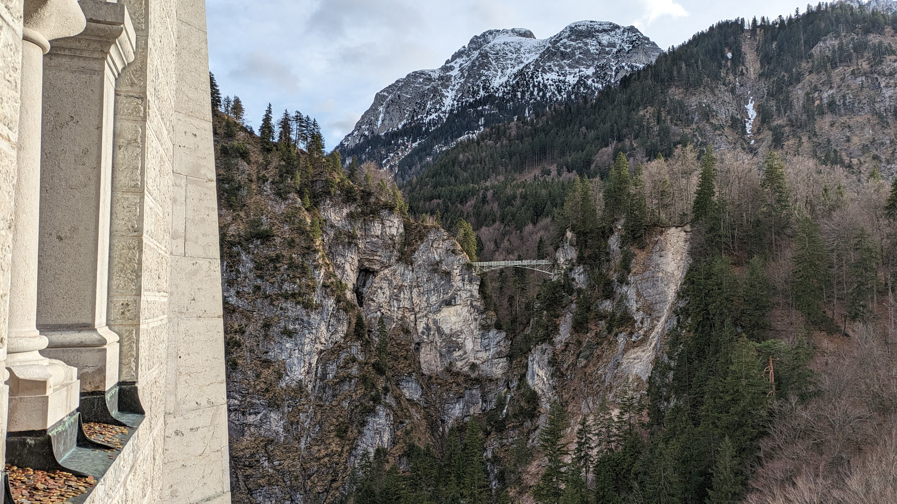

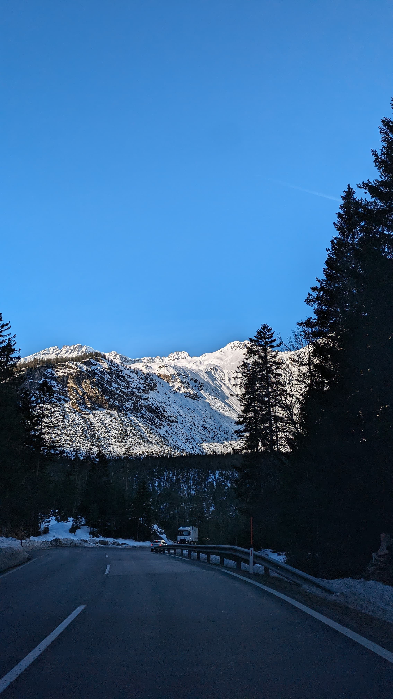

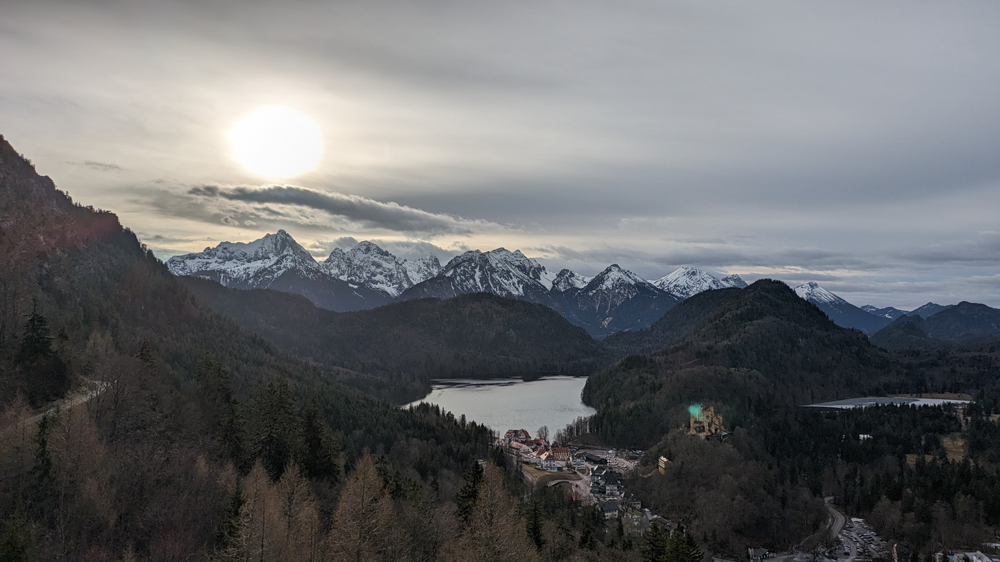

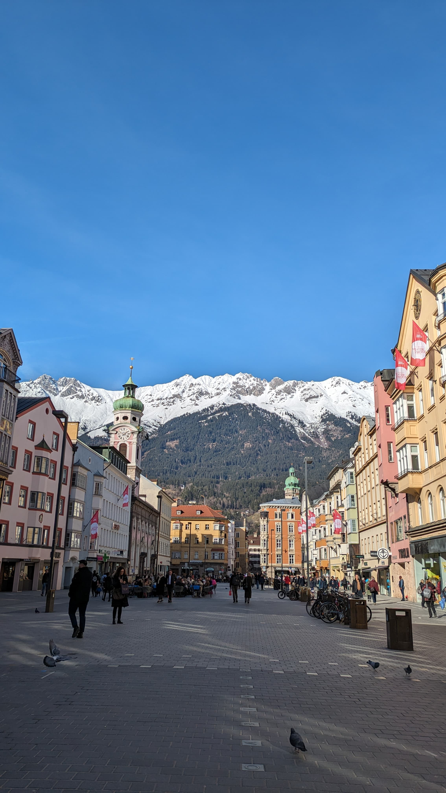

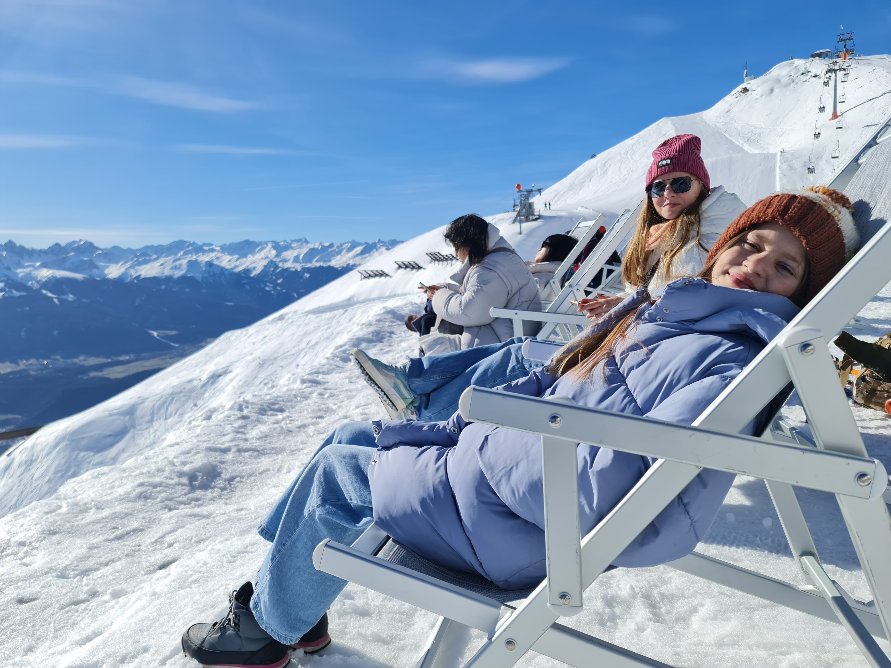

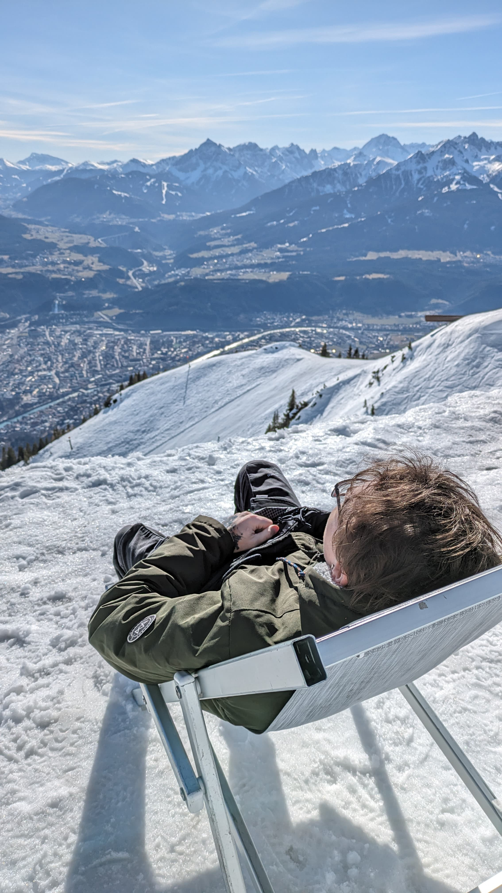

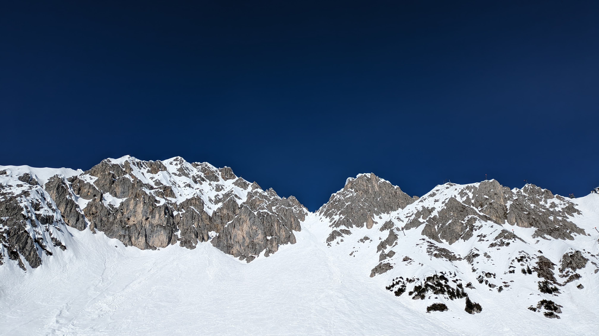

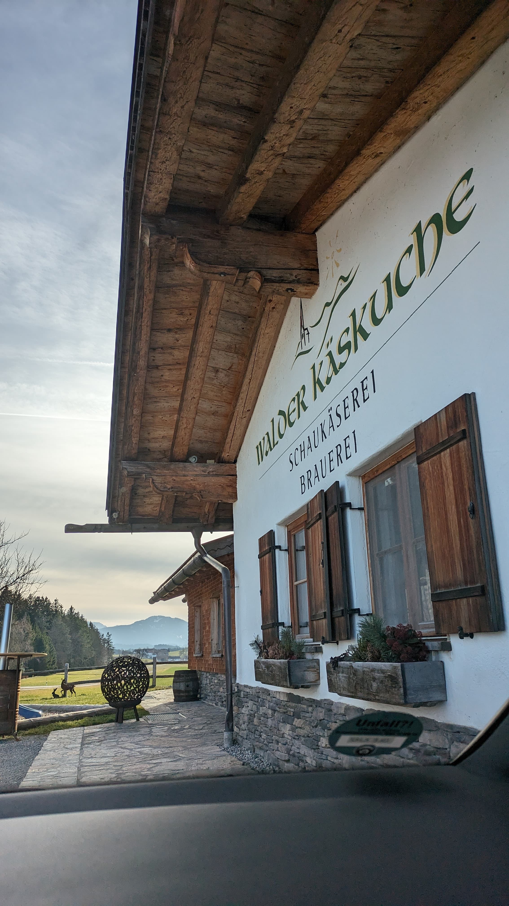

These beautiful images done by my wife on Pixel 7a. She will be happy if you follow her on [Instagram](https://www.instagram.com/dream_quarter/).
